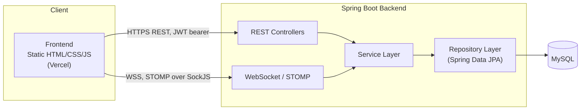
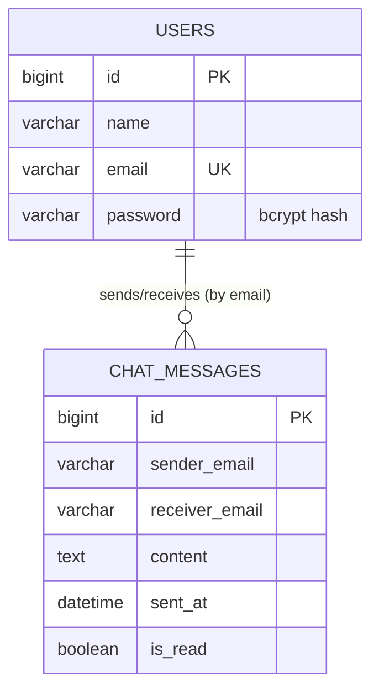
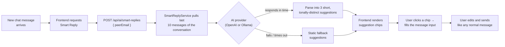

# AI Chat Hub

**AI-Powered Distributed Real-Time Chat Application**

A full-stack, real-time chat application with JWT authentication, live
WebSocket messaging, MySQL persistence, and AI-powered Smart Reply
suggestions. Built as a two-project monorepo — a Spring Boot API/WebSocket
backend and a static HTML/CSS/JS frontend — fully decoupled and
independently deployable.

```
Backend/    Spring Boot 3 + WebSocket (STOMP) + Spring AI + MySQL (Java/Maven)
Frontend/   Static HTML/CSS/JS client (no build step, deploys as-is)
```

---

## Table of contents

- [Overview](#overview)
- [Problem statement](#problem-statement)
- [Objectives](#objectives)
- [Key features](#key-features)
- [Technologies used](#technologies-used)
- [System architecture](#system-architecture)
- [Frontend architecture](#frontend-architecture)
- [Backend architecture](#backend-architecture)
- [Database architecture](#database-architecture)
- [JWT authentication](#jwt-authentication)
- [WebSocket real-time communication](#websocket-real-time-communication)
- [AI / Smart Reply architecture](#ai--smart-reply-architecture)
- [Folder structure](#folder-structure)
- [Installation requirements](#installation-requirements)
- [Local setup](#local-setup)
- [MySQL setup](#mysql-setup)
- [Environment variables](#environment-variables)
- [Running the application](#running-the-application)
- [API overview](#api-overview)
- [WebSocket overview](#websocket-overview)
- [Smart Reply workflow](#smart-reply-workflow)
- [Production deployment](#production-deployment)
- [Troubleshooting](#troubleshooting)
- [Security considerations](#security-considerations)
- [Future enhancements](#future-enhancements)
- [Running tests](#running-tests)

---

## Overview

AI Chat Hub is a two-person-to-two-person (1:1) real-time messaging
application: users register, log in, see who else is registered, and chat
with them instantly over a WebSocket connection, with full message history
persisted in MySQL. An AI layer (OpenAI or a local Ollama model,
interchangeably) powers two features on top of that: **Smart Reply**
(context-aware suggested responses inside a conversation) and a standalone
**AI Assistant** chat page.

## Problem statement

Most "build a chat app" tutorials stop at either the real-time messaging
part *or* the AI part, rarely both, and rarely with production concerns
(auth, CORS, deployment, secret handling) treated seriously. This project
sets out to build a chat application that is simultaneously:

- **Real-time** — messages must arrive instantly, not on a polling delay.
- **Persistent** — a message survives a refresh or logging in from a
  different device/browser.
- **Secure** — every API and WebSocket connection is authenticated; no
  secret is ever hardcoded or exposed to the client.
- **AI-augmented** — without letting the AI layer become a single point of
  failure for the rest of the app.
- **Actually deployable** — configured from day one via environment
  variables rather than hardcoded `localhost` values that only work on one
  machine.

## Objectives

1. Implement secure user registration and login backed by hashed
   passwords and stateless JWT authentication.
2. Implement real-time, bidirectional messaging over WebSocket (STOMP),
   authenticated the same way as the REST API.
3. Persist every message and make full conversation history retrievable,
   independent of any single browser's local storage.
4. Integrate an AI provider to generate short, contextual reply
   suggestions from real conversation history, with a provider that can
   be swapped (OpenAI ↔ local Ollama) without code changes.
5. Ensure AI failures degrade gracefully — normal chat must never break
   because the AI layer is slow, down, or unconfigured.
6. Keep the whole system configurable purely through environment
   variables, so the same codebase runs unmodified in local dev and in
   production.

## Key features

- **Authentication** — register/login with bcrypt-hashed passwords, JWT
  issuance and validation, server-side logout (token revocation, not just
  a client-side redirect), profile editing (name + password change).
- **Real-time messaging** — WebSocket chat via STOMP/SockJS: instant
  delivery, typing indicators, online/offline presence (correct across
  multiple open tabs/devices), read receipts, per-conversation unread
  counts.
- **Message persistence** — every message is stored in MySQL and survives
  a refresh or a login from a different device (`GET /api/chat/history`,
  `GET /api/chat/conversations`).
- **AI Smart Reply** — three short, context-aware, tonally distinct reply
  suggestions generated from the last 10 messages of a conversation, with
  a graceful static fallback if the AI provider is slow, down, or not
  configured.
- **AI Assistant** — a standalone free-form chat page backed by the same
  configurable AI provider.
- **Contacts, Chat History, Profile, Settings, About** pages, all backed
  by real API calls — no mock data.

## Technologies used

| Layer      | Technology |
|------------|------------|
| Backend    | Java 21, Spring Boot 3.5, Spring Security, Spring Data JPA, Spring WebSocket (STOMP), Spring AI (OpenAI + Ollama), JJWT, BCrypt, Maven |
| Database   | MySQL 8 (Hibernate `ddl-auto=update`) |
| Frontend   | HTML5, CSS3, vanilla JavaScript (ES2017+), SockJS, @stomp/stompjs — no framework, no build step |
| Testing    | JUnit 5, Spring Boot Test, AssertJ, H2 (in-memory, test-only) |
| Deployment | Vercel (frontend, static), any JVM host — Render/Railway/Fly.io/EC2 (backend) |

## System architecture



Every request — REST or WebSocket — passes through the same layering:
**Controller → Service → Repository → MySQL**. Controllers never talk to
the database directly, and DTOs (not JPA entities) are what actually
cross the wire, so internal fields (ids, password hashes, the `read`
flag) never leak into an API response by accident.

## Frontend architecture

The frontend is a plain static site — **no React, no Vite, no build
step** — by design, so it deploys as-is to any static host. Every
authenticated page follows the same pattern:

1. `assets/config.js` — sets `window.CHATAPP_API_BASE` (the one
   deployment-specific value).
2. `assets/api.js` — shared module: session storage (JWT in
   `localStorage`), an authenticated `fetch` wrapper that auto-redirects
   to login on a 401/403, formatting helpers, toasts, and the shared
   sidebar shell.
3. `assets/<page>.js` — the page's own logic, e.g. `messages.js` owns the
   WebSocket connection and chat UI; `login.js` owns the login form.

Pages: `index.html` (public landing page), `login.html`, `register.html`,
then behind auth: `dashboard.html`, `messages.html`, `contacts.html`,
`chat-history.html`, `ai-assistant.html`, `profile.html`, `settings.html`,
`about.html`.

## Backend architecture

```
com.mansha.chatapp
├── config/       WebSocket setup, AI client beans, AI provider auto-detection,
│                 Ollama warmup, WebSocket connect/disconnect listeners
├── controller/    REST (@RestController) + STOMP (@MessageMapping) endpoints
├── dto/          Request/response shapes — never expose entities directly
├── entity/       JPA entities: User, ChatMessage
├── exception/    @RestControllerAdvice — turns exceptions into consistent JSON
├── repository/   Spring Data JPA repositories
├── security/     JwtService, JwtAuthenticationFilter, JwtChannelInterceptor,
│                 TokenBlacklistService, SecurityConfig (CORS + auth rules)
└── service/      Business logic: ChatService, PresenceService,
                  SmartReplyService, AiAssistantService, UserService
```

Controllers are intentionally thin — validation and business rules live in
the service layer (e.g. `ChatService.saveMessage` rejects empty content,
self-messaging, and unknown recipients before anything touches the
database), so the same rules apply whether a message arrives over the REST
API or the WebSocket.

## Database architecture

Two tables, MySQL, managed by Hibernate (`ddl-auto=update` — no manual
migrations needed):



- `users.email` is the identity used everywhere — in JWTs, WebSocket
  principals, and message rows — rather than a numeric foreign key, which
  keeps the message table decoupled from user-table internals.
- `chat_messages` has composite indexes on `(sender_email, receiver_email)`
  and `sent_at` to keep conversation history and unread-count queries fast
  as message volume grows.
- Passwords are bcrypt-hashed before storage; the entity's `password`
  field is `@JsonProperty(WRITE_ONLY)`, so it's accepted on the way in
  (register/login) but can never be serialized back out in any API
  response.

## JWT authentication

- **Login** issues a signed HMAC JWT (`JwtService`) with the user's email
  as the subject and a 24-hour expiry.
- **Every HTTP request** to a protected route passes through
  `JwtAuthenticationFilter`, which validates the `Authorization: Bearer
  <jwt>` header before Spring Security's authorization check runs.
- **Every WebSocket connection** passes through `JwtChannelInterceptor` on
  the STOMP `CONNECT` frame — the same validation, so there is no
  "authenticated over REST but not over WebSocket" gap.
- **Logout is not just client-side.** `POST /api/users/logout` adds the
  token to an in-memory `TokenBlacklistService`, checked by
  `JwtService.extractEmail` — so a signed-out token stops working
  immediately, instead of silently remaining valid for the rest of its
  24-hour lifetime.
- **Password storage** uses bcrypt (`BCryptPasswordEncoder`). Legacy
  plaintext accounts (if any existed before hashing was added) are
  transparently upgraded to a hash the moment they next log in
  successfully.

## WebSocket real-time communication

- Endpoint: `/ws` (SockJS-wrapped STOMP, degrades gracefully without
  native WebSocket support; also reachable as a raw WebSocket at
  `/ws/websocket`).
- **Sending a message**: client publishes to `/app/chat.send` with
  `{ receiverEmail, content }`. The server validates and persists it, then
  delivers it to both the sender's and receiver's private queue
  (`/user/queue/messages`) — so every open tab of either user stays in
  sync, and the sender sees their own message appear immediately too.
- **Typing indicators**: `/app/chat.typing` → relayed live to
  `/user/queue/typing`, never persisted.
- **Presence**: connect/disconnect events broadcast to `/topic/presence`.
  Tracked per WebSocket session (not just per user), so multiple open
  tabs/devices don't flip a user to "offline" until the *last* session
  disconnects.
- **Errors**: a rejected `chat.send` (empty message, unknown receiver,
  messaging yourself) is reported back to the sender on
  `/user/queue/errors` instead of vanishing silently into a generic STOMP
  error frame.

## AI / Smart Reply architecture



- **Provider selection** (`AiProviderResolver`): `app.ai.provider`
  defaults to `auto` — picks `openai` automatically when a real
  `OPENAI_API_KEY` is configured, otherwise `ollama`. Can be forced either
  way via `APP_AI_PROVIDER`.
- **Timeout-bounded**: Smart Reply waits at most
  `AI_SMART_REPLY_TIMEOUT_SECONDS` (default 12s) for the AI; the AI
  Assistant waits `AI_ASSISTANT_TIMEOUT_SECONDS` (default 35s). Past that,
  Smart Reply falls back to generic static suggestions rather than
  hanging the chat UI — verified live: a genuine AI timeout still returns
  a normal `200` response with usable suggestions.
- **Never blocks normal chat**: Smart Reply and the AI Assistant are
  entirely separate calls from sending/receiving a message — an AI outage
  never prevents a message from sending, arriving, or being saved.
- **No client-side API keys**: the AI provider and any API key live only
  in backend configuration; the frontend only ever calls
  `/api/ai/smart-replies` and `/api/ai/assistant` with a JWT, never an AI
  provider directly.

## Folder structure

```
chatapp/
├── Backend/
│   ├── src/main/java/com/mansha/chatapp/
│   │   ├── config/       WebSocket, AI client, AI provider resolver, warmup, WS lifecycle
│   │   ├── controller/   REST + STOMP @MessageMapping controllers
│   │   ├── dto/          Request/response shapes
│   │   ├── entity/       JPA entities (User, ChatMessage)
│   │   ├── exception/    Centralized error → JSON mapping
│   │   ├── repository/   Spring Data JPA repositories
│   │   ├── security/     JWT service/filter/channel-interceptor, token blacklist, SecurityConfig
│   │   └── service/      Business logic (chat, presence, AI, users)
│   ├── src/main/resources/application.properties   main config (env-var driven)
│   ├── src/test/         JUnit tests, running against an isolated H2 DB
│   ├── .env.example      documents every backend env var (placeholders only)
│   └── pom.xml
├── Frontend/
│   ├── assets/           one .js/.css pair per page, plus shared api.js/theme.css/config.js
│   ├── index.html        public landing page
│   ├── login.html, register.html
│   ├── dashboard.html, messages.html, contacts.html, chat-history.html
│   ├── ai-assistant.html, profile.html, settings.html, about.html
│   └── vercel.json       static-site deploy config (see Production deployment below)
├── .gitignore
└── README.md
```

## Installation requirements

- Java 21+
- Maven (or use the bundled `./mvnw` / `mvnw.cmd` wrapper — no separate install needed)
- MySQL 8+ running locally (or reachable via `DB_URL`)
- A modern browser. No Node/npm needed for the frontend.
- Optional, for AI features: an OpenAI API key, and/or a local
  [Ollama](https://ollama.com) install with a pulled model (default `llama3.2`)

## Local setup

```bash
git clone https://github.com/manshasharma2323-creator/chatapp.git
cd chatapp
```

Then follow [MySQL setup](#mysql-setup) and [Running the application](#running-the-application) below.

## MySQL setup

```sql
CREATE DATABASE ai_chat_app;
```

Tables are created/updated automatically on startup (`spring.jpa.hibernate.ddl-auto=update`) —
no manual migration step needed. Default local credentials are `root`/`root`
(override with `DB_USERNAME`/`DB_PASSWORD` if yours differ).

## Environment variables

All of these have safe local-dev defaults baked into
`Backend/src/main/resources/application.properties` — you only need to set
them for production, or to override a default. See also
`Backend/.env.example` for a copyable reference (placeholders only, no
real values).

| Variable | Purpose | Default |
|----------|---------|---------|
| `PORT` | Port the backend listens on — most PaaS hosts (Render, Railway, Heroku) inject this at runtime | `8080` |
| `DB_URL` | JDBC URL for MySQL | `jdbc:mysql://localhost:3306/ai_chat_app` |
| `DB_USERNAME` | MySQL username | `root` |
| `DB_PASSWORD` | MySQL password | `root` |
| `JWT_SECRET` | HMAC signing key for JWTs — **must** be set to a real random secret before deploying | an obviously-insecure placeholder, so you notice if you forgot |
| `ALLOWED_ORIGINS` | Comma-separated list of origins allowed to call the API / open a WebSocket (CORS) | localhost dev ports + the deployed Vercel frontend |
| `OPENAI_API_KEY` | OpenAI API key, only needed to use the `openai` provider | unset |
| `APP_AI_PROVIDER` | Force `openai` or `ollama`; leave unset to auto-pick `openai` when a real `OPENAI_API_KEY` is set, otherwise `ollama` | `auto` |
| `OLLAMA_BASE_URL` | Where to reach Ollama, if it's not on the same machine as the backend | `http://localhost:11434` |
| `AI_SMART_REPLY_TIMEOUT_SECONDS` | How long Smart Reply waits for the AI before falling back to static suggestions | `12` |
| `AI_ASSISTANT_TIMEOUT_SECONDS` | How long the AI Assistant waits before returning an error | `35` |

The frontend has exactly one configuration point:
**`Frontend/assets/config.js`** sets `window.CHATAPP_API_BASE` — the
backend's base URL. It's loaded before every other script on every
authenticated page.

**Never commit real values for any of these.** `Backend/.env.example`
exists precisely so real secrets never need to touch the repository —
copy it, fill in real values locally or in your host's dashboard, and
keep the copy out of git (see [Security considerations](#security-considerations)).

## Running the application

**Backend:**
```bash
cd Backend
./mvnw spring-boot:run
```
Runs on `http://localhost:8080` (or `$PORT` if set).

**Frontend:**
```bash
cd Frontend
npx serve .
```
Any static file server works — there's no build step. By default
`Frontend/assets/config.js` points at `http://localhost:8080`, matching
the backend above.

Then open the served frontend URL in a browser, register an account, and
sign in.

## API overview

All `/api/**` routes except register/login require
`Authorization: Bearer <jwt>`. Only endpoints that actually exist in the
code are documented here.

<details>
<summary><strong>POST /api/users/register</strong> — create an account (public)</summary>

Request:
```json
{ "name": "Ada Lovelace", "email": "ada@example.com", "password": "password123" }
```
Response `200 OK`:
```json
{ "id": 1, "name": "Ada Lovelace", "email": "ada@example.com" }
```
(password is never included in the response — write-only field)
</details>

<details>
<summary><strong>POST /api/users/login</strong> — authenticate (public)</summary>

Request:
```json
{ "email": "ada@example.com", "password": "password123" }
```
Response `200 OK` (raw JWT string body):
```
"eyJhbGciOiJIUzM4NCJ9.eyJzdWIiOiJhZGFAZXhhbXBsZS5jb20i..."
```
`401 Unauthorized` on wrong password or unknown email.
</details>

<details>
<summary><strong>POST /api/users/logout</strong> — revoke the current token</summary>

Header: `Authorization: Bearer <jwt>`. Response `200 OK`, empty body. The
token is rejected on every subsequent request from that point on.
</details>

<details>
<summary><strong>GET /api/users/me</strong> — current user's profile</summary>

Response `200 OK`:
```json
{ "name": "Ada Lovelace", "email": "ada@example.com" }
```
</details>

<details>
<summary><strong>PATCH /api/users/me</strong> — update name and/or password</summary>

Request (all fields optional — send only what changed):
```json
{ "name": "Ada L.", "currentPassword": "password123", "newPassword": "newpassword456" }
```
Response `200 OK`: same shape as `GET /api/users/me`. `400 Bad Request` if
`currentPassword` doesn't match or `newPassword` is under 6 characters.
</details>

<details>
<summary><strong>GET /api/users/contacts</strong> — everyone else registered</summary>

Response `200 OK`:
```json
[ { "name": "Bob", "email": "bob@example.com" } ]
```
</details>

<details>
<summary><strong>GET /api/chat/conversations</strong> — conversation list</summary>

Response `200 OK`:
```json
[
  {
    "peerEmail": "bob@example.com",
    "lastMessage": "See you at 10am!",
    "lastMessageAt": "2026-09-18T21:41:47.90",
    "lastMessageMine": false,
    "unreadCount": 1
  }
]
```
</details>

<details>
<summary><strong>GET /api/chat/history?with=&lt;email&gt;</strong> — full history with one peer</summary>

Response `200 OK`:
```json
[
  { "senderEmail": "ada@example.com", "receiverEmail": "bob@example.com", "content": "Hi!", "sentAt": "2026-09-18T21:40:01.12" }
]
```
</details>

<details>
<summary><strong>GET /api/chat/online</strong> — currently connected users</summary>

Response `200 OK`:
```json
[ { "email": "bob@example.com", "online": true } ]
```
</details>

<details>
<summary><strong>POST /api/chat/mark-read?with=&lt;email&gt;</strong> — mark a conversation read</summary>

Response `200 OK`, empty body.
</details>

<details>
<summary><strong>GET /api/chat/unread-counts</strong> — unread count per sender</summary>

Response `200 OK`:
```json
{ "bob@example.com": 2 }
```
</details>

<details>
<summary><strong>POST /api/ai/smart-replies</strong> — Smart Reply suggestions</summary>

Request:
```json
{ "peerEmail": "bob@example.com" }
```
Response `200 OK` (always — falls back rather than erroring):
```json
{ "suggestions": ["Sounds good", "Tell me more", "Got it, thanks"] }
```
</details>

<details>
<summary><strong>POST /api/ai/assistant</strong> — standalone AI Assistant chat</summary>

Request:
```json
{ "message": "Explain WebSockets simply", "history": [{ "role": "user", "content": "Hi" }, { "role": "assistant", "content": "Hello! How can I help?" }] }
```
Response `200 OK`:
```json
{ "reply": "A WebSocket is a persistent two-way connection..." }
```
`400 Bad Request` if `message` is blank. `503 Service Unavailable` if the
AI provider fails or times out.
</details>

## WebSocket overview

Endpoint: `/ws` (STOMP over SockJS). Connect with
`Authorization: Bearer <jwt>` as a STOMP `CONNECT` header.

| Direction | Destination | Payload |
|-----------|-------------|---------|
| publish | `/app/chat.send` | `{ receiverEmail, content }` |
| publish | `/app/chat.typing` | `{ receiverEmail, typing }` |
| subscribe | `/user/queue/messages` | Incoming/echoed chat messages |
| subscribe | `/user/queue/typing` | Peer typing status |
| subscribe | `/user/queue/errors` | Rejected send errors |
| subscribe | `/topic/presence` | `{ email, online }` broadcasts |

## Smart Reply workflow

See [AI / Smart Reply architecture](#ai--smart-reply-architecture) above
for the full diagram. In short: `POST /api/ai/smart-replies` with
`{ peerEmail }` → backend pulls the last 10 messages of that conversation
→ asks the configured AI provider for exactly 3 short, distinct reply
suggestions → returns them, or falls back to generic suggestions within
`AI_SMART_REPLY_TIMEOUT_SECONDS` if the provider is slow/unreachable.

## Production deployment

**Backend** — deploy the Spring Boot app anywhere that runs a JAR
(Render, Railway, Fly.io, EC2, etc.):
```bash
cd Backend
./mvnw clean package
java -jar target/chatapp-0.0.1-SNAPSHOT.jar
```
Set `DB_URL`, `DB_USERNAME`, `DB_PASSWORD`, `JWT_SECRET`, and
`ALLOWED_ORIGINS` (your frontend's exact deployed origin) as environment
variables on whatever platform you use — never in a committed file.

**Frontend** — deploy `Frontend/` on Vercel (or any static host):
1. Edit `Frontend/assets/config.js` and set `window.CHATAPP_API_BASE` to
   your deployed backend's URL.
2. Push. `vercel.json` at the repo root already tells Vercel this is a
   static site (no build command, `Frontend/` as the output directory) —
   no framework/build configuration needed on Vercel's side.

## Troubleshooting

- **`vite: command not found` on Vercel** — this project has no Vite/React
  build; `vercel.json` disables the build step entirely. If you see this
  error, check the Vercel dashboard's Framework Preset is set to *Other*
  and the Build/Install Command overrides are off.
- **Frontend can't reach the backend / CORS errors in the console** —
  check `Frontend/assets/config.js` points at the right backend URL, and
  that the backend's `ALLOWED_ORIGINS` includes your frontend's exact
  origin (scheme + host, no trailing slash).
- **Login works but the chat never connects** — the WebSocket handshake
  uses the same JWT; an expired/cleared/revoked token will show
  "Rejected" in the connection indicator. Sign out and back in.
- **Smart Reply always shows generic suggestions** — means the AI
  provider isn't reachable in time (Ollama not running/still cold-loading,
  or no `OPENAI_API_KEY`). This is a deliberate fallback, not a bug —
  check the backend logs for the underlying AI error (logged as a `WARN`
  from `SmartReplyService`/`AiAssistantService`), and consider raising
  `AI_SMART_REPLY_TIMEOUT_SECONDS` on slower/CPU-only Ollama hardware.

## Security considerations

- **Passwords** are bcrypt-hashed, never stored or logged in plaintext;
  the entity's password field is write-only in JSON, so it can never leak
  into an API response.
- **JWTs** are HMAC-signed, expire after 24 hours, are validated on every
  protected HTTP request *and* every WebSocket connection, and can be
  explicitly revoked via logout (not just discarded client-side).
- **CORS** is restricted to an explicit allow-list (`ALLOWED_ORIGINS`),
  not a wildcard — required because credentialed cross-origin requests
  (which SockJS's transport probing uses) cannot be safely combined with
  `Access-Control-Allow-Origin: *`.
- **No secrets in source control.** `JWT_SECRET`, `DB_PASSWORD`, and
  `OPENAI_API_KEY` are all environment-variable-only; the committed
  defaults are either obviously-fake placeholders (JWT secret) or generic
  local-dev values (`root`/`root` for MySQL). Verified via a full scan of
  both the current working tree and the entire git history — see
  [Remaining issues / repo status] in project reports for details.
- **No AI provider keys reach the frontend.** All AI calls happen
  server-side; the browser only ever talks to this backend's own
  `/api/ai/*` endpoints with a JWT.
- **Generic error messages.** The global exception handler returns
  "Something went wrong. Please try again." for unexpected server errors
  rather than leaking stack traces or internal details to the client.

## Future enhancements

Deliberately out of scope for the current version, listed here rather
than left unexplained:

- Group chat / multi-person conversations (current data model is 1:1)
- File/image attachments in chat
- Password reset via email
- Message editing or deletion
- Visible "seen" read-receipt ticks in the chat bubble UI (read status is
  already tracked server-side and used for unread counters, just not
  rendered per-message yet)
- Paginated chat history for very long conversations
- A real distributed message broker (RabbitMQ/ActiveMQ relay) in place of
  Spring's in-memory `SimpleBroker`, if the backend ever needs to scale
  to multiple instances

## Running tests

```bash
cd Backend
./mvnw test
```

Tests run against an isolated in-memory H2 database
(`src/test/resources/application.properties`) — they never touch your real
MySQL data. Coverage includes: the full register → login → authenticated
request → logout (with real token-revocation verification) flow, JWT
rejection (missing/invalid token), a genuine two-user WebSocket integration
test (real STOMP connections proving live delivery + persistence + the
error-reporting path), chat message validation, unread-count tracking, and
AI-provider auto-detection for both the "key configured" and "no key
configured" cases.
